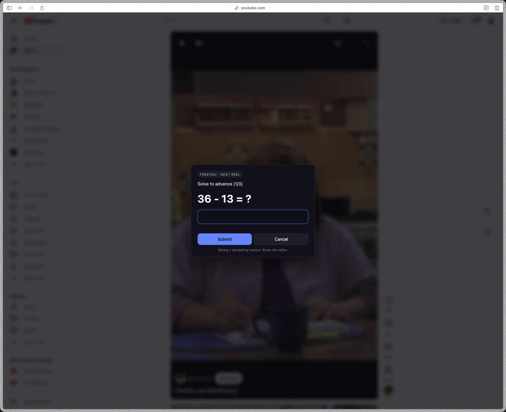
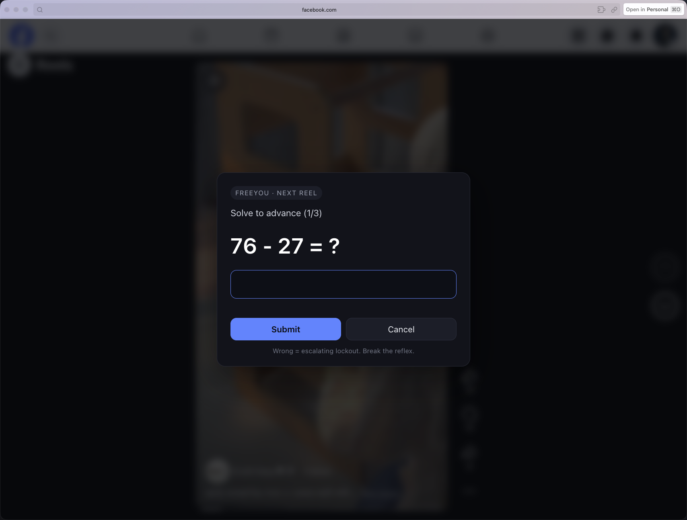
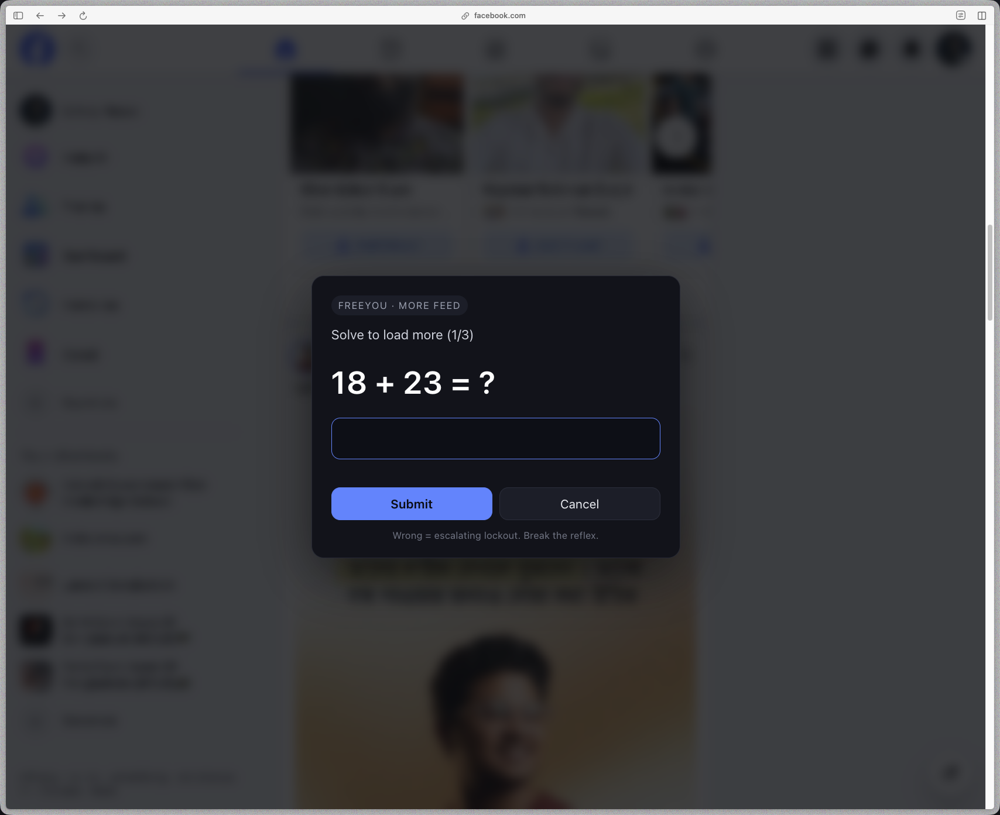

# FreeYou

**Stop the doom-scroll. Wake your brain up.**

FreeYou is a small browser extension that makes it *slightly annoying* to keep scrolling reels and endless feeds. Every time you try to swipe to the next Short, Reel, or auto-load more of your homepage, it pops up a quick math problem. Solve it, and you can move on. Get it wrong, and you have to wait.

That tiny bit of friction is the whole point — it breaks the reflex.

## What it does

### On Reels & Shorts

Scrolling, swiping, or arrow-keying to the next reel is blocked. Instead you get a math gate. The video pauses while you solve.

Works on: **YouTube Shorts**, **Facebook Reels**, **Instagram Reels**, **TikTok**.

<p align="center">
  
  &nbsp;
  
</p>

### On Home feeds

The infinite scroll on YouTube's homepage and Facebook's news feed is capped. You get about two screens of content, and to load more you have to solve a math problem.

<p align="center">
  
</p>

### Every wrong answer costs time

Get one wrong and you're locked out for a few seconds. Get the next one wrong too and it goes up. It grows: 5s → 15s → 30s → 60s. Button-mashing is punished.

---

## Install (2 minutes)

FreeYou works in any Chromium browser: **Arc**, **Google Chrome**, **Brave**, **Edge**, or **Opera**. You don't need to be a developer to install it.

### Step 1 — Get the code

**Option A: Download the ZIP (easiest)**

1. Click the green **Code** button near the top of this page.
2. Click **Download ZIP**.
3. Unzip the file. You should see a folder like `FreeYou-main` with `manifest.json` inside it.

**Option B: Clone with git**

```bash
git clone https://github.com/<your-username>/FreeYou.git
```

### Step 2 — Open the extensions page

Type one of these into your browser's address bar and press Enter:

| Browser | URL |
| --- | --- |
| Arc | `arc://extensions` |
| Chrome | `chrome://extensions` |
| Brave | `brave://extensions` |
| Edge | `edge://extensions` |
| Opera | `opera://extensions` |

### Step 3 — Turn on Developer Mode

Find the **Developer mode** toggle in the top-right corner of the extensions page and turn it on. A row of new buttons will appear.

### Step 4 — Load the extension

1. Click **Load unpacked**.
2. Pick the folder you unzipped (the one that has `manifest.json` in it — not the folder above it).
3. FreeYou should now appear in your extension list.

### Step 5 — Try it

Open any of these and try to scroll:

- youtube.com — homepage should stop after two screens
- youtube.com/shorts — next Short is blocked until you solve
- facebook.com — timeline caps after two screens
- facebook.com/reel/... — same as Shorts
- instagram.com/reels
- tiktok.com

That's it. Nothing to sign up for, nothing sent anywhere.

---

## How to use it

Just browse normally. When the gate appears:

1. Read the math problem (e.g. `47 × 3`).
2. Type the answer.
3. Press **Enter** or click **Submit**.
4. Do it two more times.
5. The reel advances, or the feed loads more.

**Wrong answer:** you're locked out briefly. Each wrong answer in a row makes the wait longer. Get one right and the timer resets.

**Cancel:** closes the gate without advancing. The reel stays where it is.

**Uninstall:** open the extensions page again and click **Remove**.

---

## Frequently asked

**Does it send my data anywhere?**
No. It runs entirely in your browser. No servers, no accounts, no tracking. The code is right here — read it.

**Why math and not a delay timer?**
A timer doesn't stop the reflex — you just wait it out and keep scrolling. Solving something forces your brain into a different mode for a few seconds. That's the whole trick.

**Can I change the difficulty or number of problems?**
Yes. Open `src/core.js` and edit the constants near the top:

- `PROBLEMS_PER_GATE` — how many problems per gate (default `3`).
- `LOCKOUT_STEPS_MS` — the wait times after wrong answers.
- `CAP_INITIAL_PAGES` — how many screens of feed you get before the first gate (default `2`).
- `CAP_STEP_PAGES` — how many more screens you get per solved gate (default `1`).

After editing, go back to the extensions page and click the **reload** icon on the FreeYou card.

**Does it work on Safari or Firefox?**
Not yet. Chromium browsers only (Arc, Chrome, Brave, Edge, Opera). Safari and Firefox use a different extension format.

**A site changed and it stopped working.**
Reels and feeds change layouts often. Open an issue and I'll update the site detection.

**Can I disable it on one site but not another?**
Not from a UI yet. For now, uninstall or open the site in a different browser profile.

---

## Under the hood (for the curious)

- Manifest V3 content-script extension.
- `src/core.js` — event blockers (wheel / key / touch), math modal, video pause, feed-cap engine, and reel advance via the site's own scroll-snap container.
- `src/platforms/*.js` — one per site. Watches the URL and decides which mode to use: `reel`, `cap`, or `off`.
- No permissions beyond `storage` and access to the four sites listed in `manifest.json`.

## License

MIT. Do what you like with it. If it helps you scroll less, that's the point.
